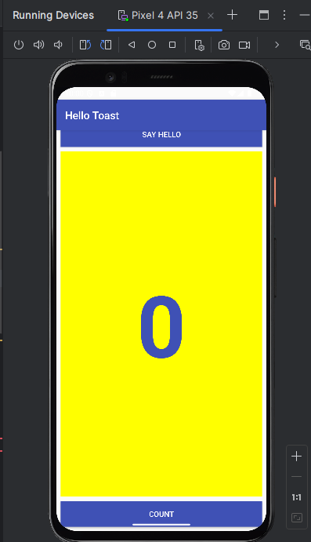
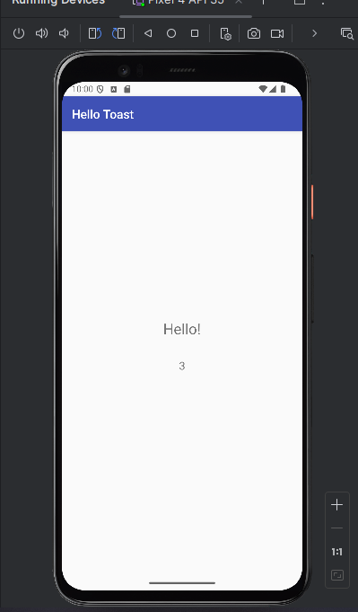

# Compte Rendu HelloToast

## Description

Cette application Android vous permet de créer une activité qui affiche un message "Hello!" et un nombre actuel à partir de la `MainActivity`. L'objectif est d'ajouter une nouvelle activité et de manipuler les `Intents` pour transférer des données entre activités.

## Questions et Réponses

### Question 1

**Quelles modifications sont apportées lorsque vous ajoutez une deuxième activité à votre application en choisissant `File > New > Activity` et un modèle d'activité ? Choisissez-en un :**

- **Réponse :**  
  La deuxième activité est ajoutée en tant que classe Java, le fichier de présentation (layout) XML est créé et le fichier `AndroidManifest.xml` est modifié pour déclarer une deuxième activité.

### Question 2

**Que se passe-t-il si vous supprimez les éléments `android:parentActivityName` de la deuxième déclaration d'activité dans le fichier `AndroidManifest.xml` ? Choisissez-en un :**

- **Réponse :**  
  Le bouton **Up** de la barre d'applications n'apparaît plus dans la deuxième activité pour renvoyer l'utilisateur à l'activité parente.

### Question 3

**Quelle méthode de constructeur utilisez-vous pour créer une nouvelle intention (Intent) explicite ? Choisissez-en un :**

- **Réponse :**  
  `new Intent(Context context, Class class)`

  **Explication :**  
  Pour créer une intention explicite, utilisez le constructeur `new Intent(Context context, Class class)`, qui permet de spécifier le contexte de l'activité actuelle et la classe de l'activité à démarrer.

### Question 4

**Dans l'application HelloToast (du Travail à faire), comment ajoutez-vous la valeur actuelle du comptage à l'intention (Intent) ? Choisissez-en un :**

- **Réponse correcte :**  
  Comme **extra** d'intention (Intent).

  **Explication :**  
  Pour transmettre la valeur du comptage à l'intention, vous pouvez utiliser la méthode `putExtra("key", value)` pour envoyer les données supplémentaires avec l'intention.

### Question 5

**Dans l'application HelloToast (du Travail à faire), comment afficher le nombre actuel dans la deuxième activité "Hello" ? Choisissez-en un :**

- **Réponse correcte :**  
  Tout ce qui précède.

  **Explication :**  
  Pour afficher le nombre actuel dans la deuxième activité, vous devez :

  - Récupérer l'intention avec `getIntent()`.
  - Obtenir la valeur du comptage à partir de l'intention avec `getIntent().getIntExtra("key", defaultValue)`.
  - Mettre à jour le `TextView` avec la valeur du comptage.

## Conclusion

Cette application montre comment gérer les activités et les `Intents` dans une application Android, ainsi que la transmission de données entre elles. En ajoutant une nouvelle activité, vous pouvez explorer les fonctionnalités de gestion de la navigation et des données dans Android.

---
